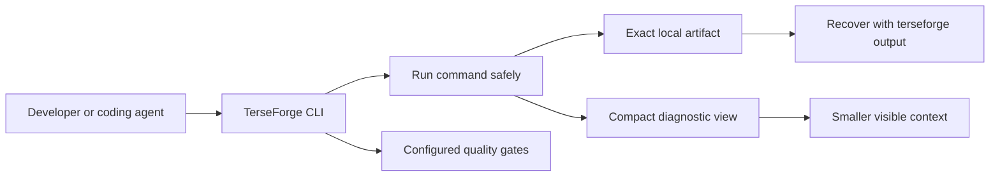

<p align="center">
  
</p>

<h1 align="center">TerseForge</h1>

<p align="center">
  <strong>Big code. Small chatter.</strong><br>
  Local, measurable context and tool-output optimization for AI coding agents.
</p>

<p align="center">
  <a href="https://github.com/luucabg/terseforge/actions/workflows/ci.yml"></a>
  <a href="https://github.com/luucabg/terseforge/releases/tag/v0.1.0"></a>
  
  <a href="LICENSE"></a>
  
</p>

<p align="center">
  <a href="#quick-start">Quick start</a> ·
  <a href="#how-it-works">How it works</a> ·
  <a href="#compatibility">Compatibility</a> ·
  <a href="#measured-component-benchmark">Benchmark</a> ·
  <a href="#documentation">Documentation</a>
</p>

---

TerseForge helps coding agents spend less of their context window on terminal noise and broad file reads. It keeps full logs local, surfaces the lines that matter, selects TypeScript and JavaScript context progressively, and runs the checks you choose.

It does not replace your agent, call a model, or send your code anywhere.

Install the Agent Skill once. Then ask your coding agent:

> **Activate TerseForge in this project.**

> [!IMPORTANT]
> TerseForge reduces context and visible output. It does not lower the quality bar. Errors, warnings, paths, line numbers, commands, diffs, and security findings stay protected. Required quality gates must pass before work is considered verified.

## Keep the signal. Drop the noise.

A long test run may contain hundreds of routine lines and only a few useful diagnostics. Sending everything wastes context. Blind truncation is worse: it can hide the line that explains the failure.

TerseForge makes reduction reversible:

| Problem | What TerseForge does |
| --- | --- |
| Large terminal logs consume context | Shows a compact diagnostic view and stores the complete output locally. |
| An omitted line becomes important later | Recovers the exact artifact or any inclusive line range. |
| The agent reads whole files too early | Ranks TS/JS paths, imports, symbols, and snippets within a budget. |
| Token savings tempt agents to skip checks | Runs explicit typecheck, lint, test, and build gates. |
| Integration claims are vague | Labels each agent as native-limited, instructions-only, or experimental. |
| You do not want to upload code or logs | Keeps state local under `.terseforge/` and sends no remote telemetry. |

The rule is simple: compact what the agent sees, but keep the source available.

## Quick start

TerseForge is not published to npm yet. Install the v0.1 MVP from source:

```bash
git clone https://github.com/luucabg/terseforge.git
cd terseforge
npm ci
npm run build
npm link
```

Install the native Agent Skill once for the agent you use:

```bash
terseforge skill install --agent codex
# or: terseforge skill install --agent claude
# or: terseforge skill install --agent gemini
```

Start a new agent session, open a repository, and ask:

```text
Activate TerseForge in this project.
```

If the project has no configuration, the skill starts with the conservative `safe` preset. It also installs a project-scoped copy for future sessions and runs `terseforge doctor`. Ask for another preset when you want one, for example: `Use TerseForge lean in this project.`

Prefer explicit setup? `safe` is still the default:

```bash
cd /path/to/your/repository
terseforge init --preset safe --install codex claude
terseforge doctor
```

Then use the compact workflow:

```bash
terseforge map
terseforge context "refresh token validation" --symbol validateToken --budget 800
terseforge exec -- npm test
terseforge check
```

If compact output omits something you need, recover it byte for byte:

```bash
terseforge output <run-id>
terseforge output <run-id> --lines 100:180
```

`init` never overwrites an existing agent instruction file. It installs only the integrations explicitly named with `--install` and keeps reference copies under `.terseforge/integrations/`.

## How it works



The CLI uses executable-and-argument arrays rather than a user-controlled shell expression. Successful process launches write the complete byte stream to `.terseforge/artifacts/`, while the visible view retains diagnostics and adds an exact recovery command.

Context selection follows a separate progressive path:

```text
tracked files → TS/JS candidates → imports and symbols → ranked snippets → token estimate
```

See the [architecture](docs/architecture.md) for module and failure-policy details.

The installer preserves files it does not own. Read [Agent Skill setup](docs/skills.md) for discovery paths, direct invocation, updates, and removal.

## CLI commands

| Command | Purpose |
| --- | --- |
| `terseforge init` | Conservative configuration plus optional agent instruction files. |
| `terseforge mode <safe\|lean\|ultra>` | Change only the current preset without resetting configuration. |
| `terseforge skill install\|status` | Install or inspect the natural-language Agent Skill. |
| `terseforge doctor` | Runtime, configuration, and integration diagnostics. |
| `terseforge exec -- <command> [args...]` | Compact visible output with a complete local artifact. |
| `terseforge output <run-id> [--lines 20:60]` | Exact recovery of all output or a selected line range. |
| `terseforge map [--json]` | A compact TS/JS map of imports and top-level symbols. |
| `terseforge context "query" [--symbol name]` | Ranked, numbered snippets within a configurable budget. |
| `terseforge check` | Configured gates; required failures return a non-zero exit code. |
| `terseforge handoff "objective"` | A deterministic local session handoff. |
| `terseforge stats [--json]` | Local execution and visible-byte metrics. |
| `terseforge bench [--json]` | The reproducible pruning-and-recovery benchmark. |

Visible-byte statistics include the recovery instruction itself. Very short outputs can therefore report negative savings; TerseForge exposes that overhead instead of hiding it.

## Presets

| Preset | Routine head / tail | Duplicate diagnostics | Best fit |
| --- | ---: | --- | --- |
| **`safe`** | 60 / 60 lines | Preserved | New repositories, risky changes, and debugging. **Default.** |
| **`lean`** | 25 / 25 lines | Exact duplicates counted | Daily work after validating the repository. |
| **`ultra`** | 10 / 10 lines | Exact duplicates counted | Explicitly chosen low-chatter workflows. |

All presets retain diagnostic content. If nearly every line is an error or warning, the compact output may remain large. Correctness wins over compression.

## Compatibility

Compatibility is based on what the integration can do, not on how many product logos fit in the README.

| Agent | v0.1 level | Available today | Not claimed |
| --- | --- | --- | --- |
| Claude Code | **Native-limited** | Native `terseforge` skill, `/terseforge`, `CLAUDE.md`, and explicit CLI workflow. | Automatic interception of every tool call. |
| Codex | **Native-limited** | Native `terseforge` skill, `$terseforge`, `AGENTS.md`, and explicit CLI workflow. | Automatic replacement of tool results. |
| Gemini CLI | **Native-limited** | Native `terseforge` Agent Skill, natural-language activation, `GEMINI.md`, and explicit CLI workflow. | Stable hook interception. |
| Other `AGENTS.md` agents | **Instructions-only** | Portable policy and CLI commands. | Runtime enforcement. |
| Cursor, Windsurf, Cline | **Instructions-only** | Persistent rule-file assets. | Automatic command routing. |

**Native-limited** means the agent natively loads an included instruction or skill format. It does not mean TerseForge transparently controls the agent. Read the complete [compatibility contract](docs/compatibility.md).

## Measured component benchmark

The included benchmark generates a fixed 504-line synthetic TypeScript test log, compresses it with every preset, checks that known diagnostics remain visible, and verifies byte-for-byte raw recovery.

| Preset | Visible-byte reduction | Diagnostics retained | Raw output recoverable |
| --- | ---: | :---: | :---: |
| `safe` | 75.78% | Yes | Yes |
| `lean` | 88.99% | Yes | Yes |
| `ultra` | 94.64% | Yes | Yes |

Run it yourself:

```bash
npm run build
node dist/cli.js bench --json
```

> [!CAUTION]
> These numbers measure one deterministic tool-output component. They are **not** claims about total tokens, model cost, task success, or code quality. End-to-end claims require controlled A/B agent runs.

The committed result is in [`benchmarks/baseline-v0.1.json`](benchmarks/baseline-v0.1.json). The full protocol and release criteria are in [benchmarking](docs/benchmarking.md).

## Configuration

`terseforge.config.json` is local, declarative, and safe to version:

```json
{
  "schemaVersion": 1,
  "preset": "safe",
  "telemetry": false,
  "context": {
    "budgetTokens": 1200,
    "maxFileBytes": 200000
  },
  "output": {
    "artifactRetentionDays": 30
  },
  "qualityGates": [
    {
      "name": "test",
      "command": "npm",
      "args": ["test"],
      "required": true,
      "timeoutMs": 300000
    }
  ]
}
```

Commands and arguments stay separate. Shell expressions such as `npm test && deploy` are rejected. v0.1 records artifact-retention intent but does not delete artifacts automatically. See the [configuration reference](docs/configuration.md).

## Local by design

| Property | v0.1 behavior |
| --- | --- |
| Server | None required or included. |
| Model calls | None. TerseForge is not an LLM proxy. |
| Remote telemetry | None. The configuration only accepts `false`. |
| Stored data | Artifacts, metrics, reports, and handoffs under `.terseforge/`. |
| Process execution | Argument arrays; no concatenated user-controlled shell expression. |
| Failure policy | Compression remains recoverable; required quality gates fail closed. |

Command output can contain secrets. Raw artifacts use owner-only permissions where the operating system supports them; treat `.terseforge/` as sensitive local data. Read the [privacy model](docs/privacy.md) and [security policy](SECURITY.md).

## Project status

TerseForge `v0.1.0` is an experimental, working MVP for Node.js 22 and 24 on Windows, macOS, and Linux. CI runs type checking, ESLint, tests with coverage thresholds, a production build, CLI smoke tests, and the component benchmark.

Deliberate v0.1 exclusions:

- no adaptive `auto` preset;
- no embeddings, vector database, or semantic model;
- no remote telemetry, server, or dashboard;
- no automatic transcript or session interception;
- no custom diff engine;
- no claim of complete support for every coding agent;
- no npm publication yet.

## Documentation

- [Architecture and failure policy](docs/architecture.md)
- [Configuration reference](docs/configuration.md)
- [Compatibility contract](docs/compatibility.md)
- [Agent Skill setup](docs/skills.md)
- [Benchmark methodology](docs/benchmarking.md)
- [Privacy model](docs/privacy.md)
- [Brand and messaging guidelines](docs/brand-guidelines.md)
- [Machine-readable project summary](llms.txt)
- [Example workflow](examples/README.md)
- [Changelog](CHANGELOG.md)

## Contributing

Issues and focused pull requests are welcome. Start with [CONTRIBUTING.md](CONTRIBUTING.md), run `npm run check`, and keep performance claims tied to reproducible evidence.

TerseForge is available under the [MIT License](LICENSE).
